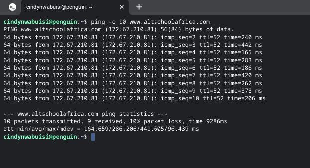
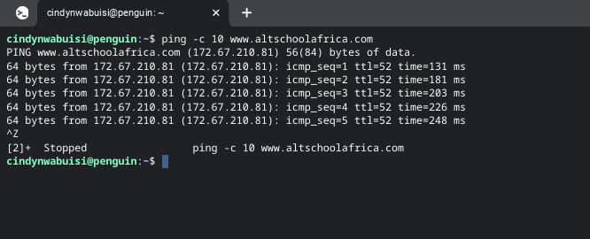
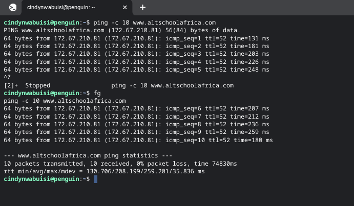
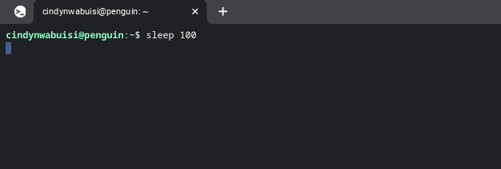
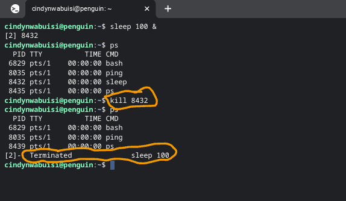
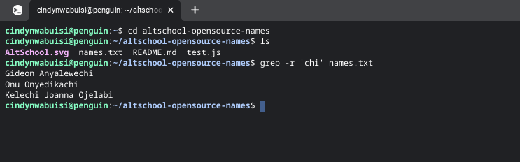
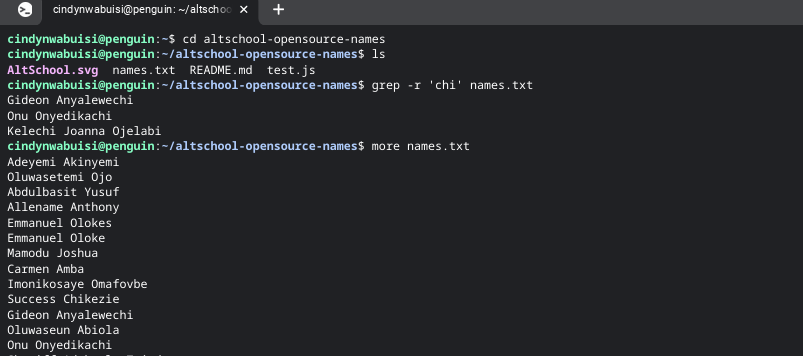
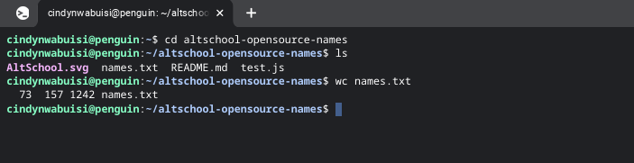
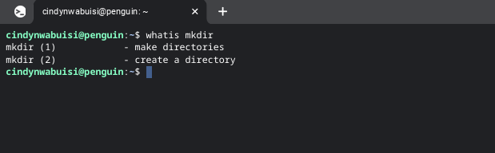
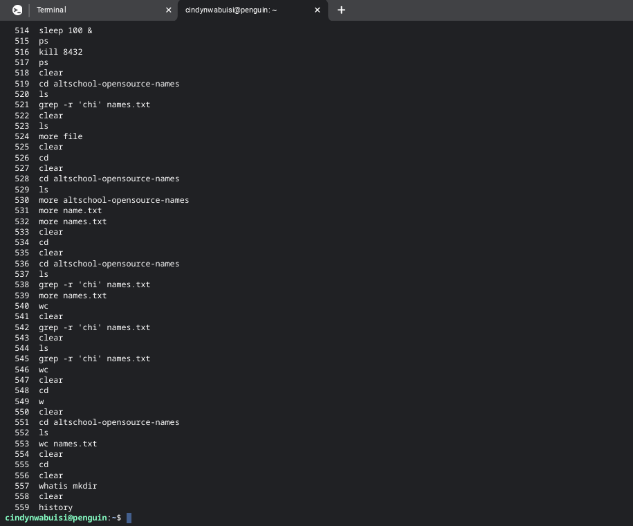

# Exercise 2

## Linux commands 

1. **ping command** : this command is used to test network connectivity. pings host and outputs results

2. **ctrl z command** : this is used to stop a current command 

3.**fg command** : it stands for foreground.This command is used to resume a stopped command on the foreground

4.**sleep command** : this is used to render a terminal inactive for a specified time.

5.**kill command** : this is used to terminate process id

6.**grep command** : this searches for lines thst match a regular expression and prints thems

7.**more command** : this outputs the content of a file

8.**wc command** : it stands for word count. this returns the number of words in text file.

 wc names.txt 

 # 73 157 1242  means   73 lines 157 words 1242 byte-size 

9.**whatis command** : this prints a single-line description of any other command making it a helpful reference

10.**history command** : this displays an enumerated list with commands one have used in the past.

